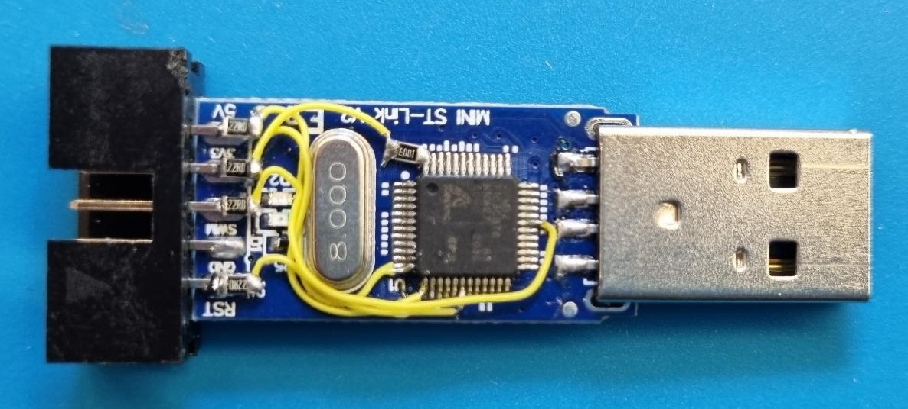

# Chinese ST-Link V2 upgrade

# Introduction

The above shown ST-LINK V2 chinese clone STM32 programmers can be picked up from [Aliexpress](https://nl.aliexpress.com/wholesale?SearchText=stlink+v2) for only a few euro's. This repository will show you how to upgrade your ST-LINK V2 to a ST-LINK V2.1, adding:

* **VCP**, a Virtual COM Port, to comunicate with the target device over UART
* **MSD**, a Virtual Mass Storage Device, where you can drop your binary to program the target device

The upgrade involves both firmware and hardware modifications, changing the pinout as shown below.

# Wat you'll need

* **TWO** chinese clone ST-LINK V2 programmers
  * One target ST-LINK to be upgraded
  * One ST-LINK to upgrade the target
* Soldering iron
* Solder pump or solder wick
* Multimeter
* 4 female header cables
* Utility knive or scalpel
* Small (single strand) isolated wire
* Side cutter
* SMD resistors
* Windows PC
* STM32 ST-LINK Utility v4.3.0 program
* Protected-2-1-Bootloader.bin file

# Step 1: Firmware

## Soldering programming pins

To be able to flash our new bootloader and update to ST-LINK V2.1 we need access to the device's programming pins. Start by taking of the metal cover (in the direction of the USB header), and look for 4 metal pads close to the edge of the PCB. 

If you are lucky the pads are already labled, if not use the multimeter to test to which pins of the MCU the pads are connected and lable accordingly. Note the dot in the top left corner of the MCU indicating pin 1. The pads should connect to the following pins in the MCU:

| Pad | MCU pin          |
|:---:|:----------------:|
| 3v3 | Any of the VDD_x |
| GND | Any of the VSS_x |
| DIO | Pin 34, PA13     |
| CLK | Pin 37, PA14     |

With the pads labled, solder 4 female header cables to the 4 pads as shown in the image below.

The target ST-LINK is now ready to be flashed with the new bootloader. Start by connecting the female header wires to your second ST-Link as follows:

| Pad wire | Second ST-LINK   |
|:--------:|:----------------:|
| 3v3      | 3.3V             |
| GND      | GND              |
| DIO      | SWDIO            |
| CLK      | SWCLK            |

## Flashing the protected boodloader

Download the STM32 ST-LINK Utility v4.3.0 program and the protected boodloader file provided in the .rar file given above. Before installing the Utility program, make sure no more-recent-version of the Utility program is already installed.

Run the STM32 ST-LINK Utility v4.3.0 program, and connect the second ST-LINK to your PC over USB. 

The First thing to do is to remove the read write protection of our target ST-LINK. In the Utility program click on **Target** ➔ **Option Bytes...**, set **Read Out Protection** to **Disabled** and click **Apply**.

Next we flash the protected bootloader. In the Utility program click on **Target** ➔ **Program & Verify...**, select the **Protected-2-1-Bootloader.bin** File, and click **Start**.

If the flashing of the new bootloader was succesful the log at the botom left of the Utility program should look something like shown below. Double check if the two checksums match.

## Enabling MSD & VCP

With the new bootloader flashed, the MSD and VCP features can be enabled over USB using the Utility program.

Disconnect the second ST-LINK from your pc and connect the just flashed ST-LINK to your PC over USB.

In the Utility program click on **ST-LINK** ➔ **Firmware update**, click on **Device Connect**, select the **STM32+MSD+VCP** Option, and click on **"Yes >>>>"** to upgrade the ST-LINK firmware.

After upgrading you should receive a notification that the upgrade was succesful, close the notification by clicking **OK** and check if the new Firmware Version matches the one shown below.

# Step 2: Hardware

Start by desoldering the 4 female header wires we soldered in the previous step, and turn over the PCB so the main MCU faces up.

Using a solder pump or some solder wick, remove as much solder as possible from the pads indicated with the 4 red arrows.

Use your utility knive or scalpel to cut through the traces connecting the pads to rest of the PCB. Re-apply solder to the 4 pins and use the multimeter to verify you have succesfully cut the connections.

Solder a 22Ω resistor on each of the 4 pins. Make sure only the left-hand side of the resistors contacts the solder/pin.

Following the schematic shown at the start of this section connect each of the just soldered resistors to its corresponding pin on the MCU. Start with the wire connected to pin 12 of MCU and move your way up to the wire connected to pin 31.

Solder a 100KΩ resistor to pin 48 of the MCU. Use another wire to connect the other side of the resistor to the 22Ω resistor of the RX pin.

# Step 3: Validating!